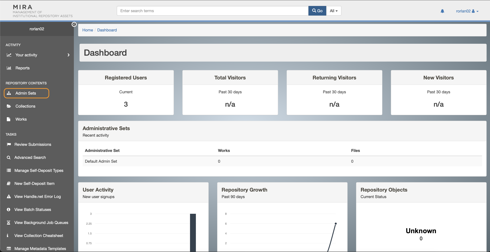
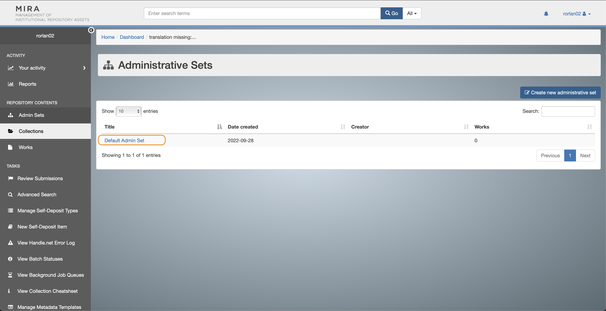

# Setting Up Mira on your Computer
This is a short guide to setting up Mira locally on your development machine.


## Download Docker
Download Docker from https://www.docker.com

## Get the Code
Clone the code locally. Decide what folder you want the code to be in and run this at that level.
```
git clone https://github.com/TuftsUniversity/mira_on_hyrax.git
```

## Add Your Crediatals
In `lib/tasks/create_admin.rake`

Add your credentials like so:
```
ryan = {
 email: 'ryan.orlando@tufts.edu',
 username: 'rorlan02',
 password: SecureRandom.hex
 }
```
Make sure to add it to the users list.
```
users.push(ryan)
```

## Run Preint Script
`./preinit_new_environment.sh`


## Build the Docker Container 
```
docker-compose build
```

## Bring up the Docker Container
```
docker-compose up
```

### Init new docker Environment
In a separate shell, connect to the hyrax server container and run `init_new_docker_environment.sh`
```
docker exec -it mira_on_hyrax_server_1 /bin/bash
./init_new_docker_environment.sh
```


## Let's test it out
Go to localhost:3000. Login with your tufts username and password. Go to Admin Set and see that Default Admin Sets exist.



