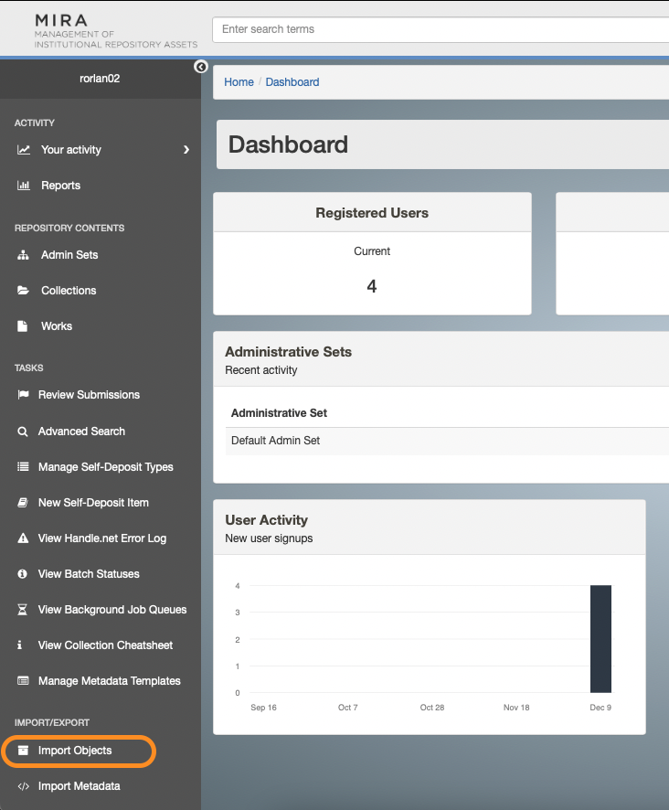
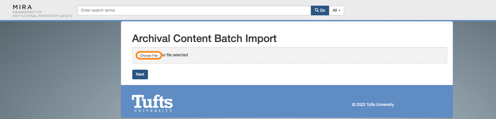
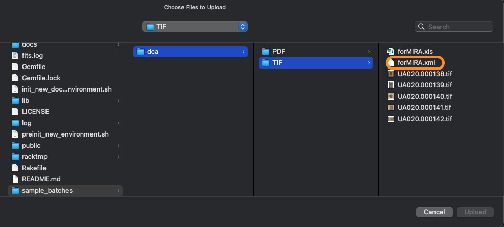
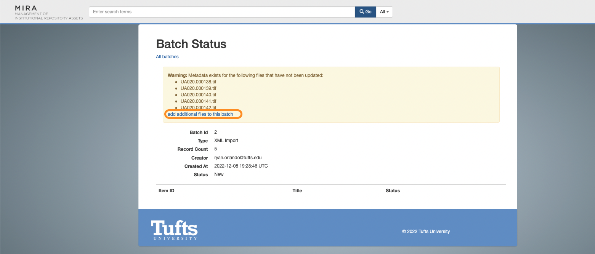
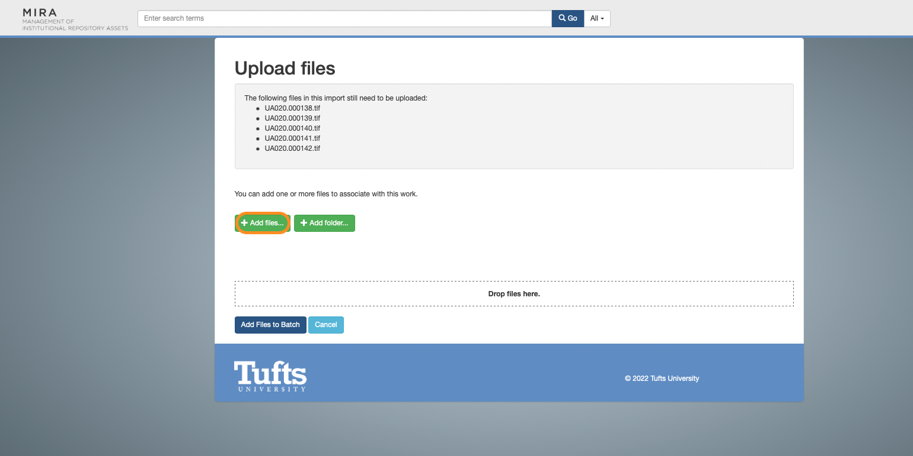
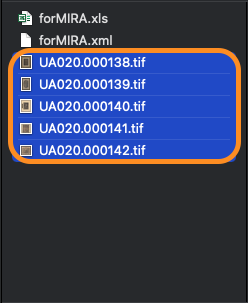
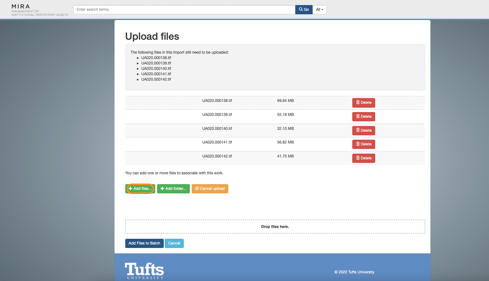
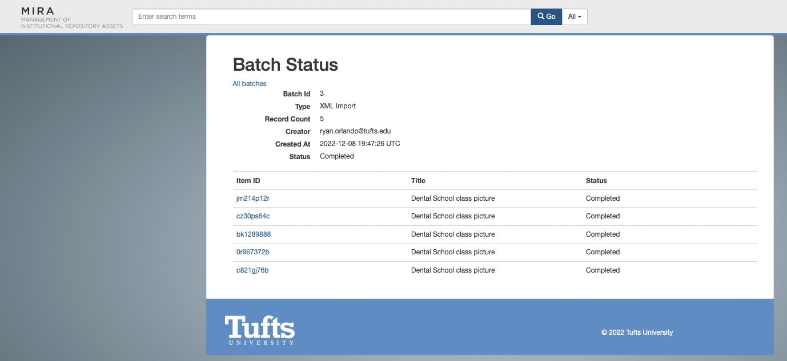

# Setting Up Mira on your Computer
This is a short guide to setting up Mira locally on your development machine.


## Download Docker
Download Docker from https://www.docker.com

## Get the Code
Clone the code locally. Decide what folder you want the code to be in and run this at that level.
```
git clone https://github.com/TuftsUniversity/mira_on_hyrax.git
```

## Add Your Crediatals
In `lib/tasks/create_admin.rake`

Add your credentials like so:
```
ryan = {
 email: 'ryan.orlando@tufts.edu',
 username: 'rorlan02',
 password: SecureRandom.hex
 }
```
Make sure to add it to the users list.
```
users.push(ryan)
```

## Run Preint Script
`./preinit_new_environment.sh`


## Build the Docker Container 
```
docker-compose build
```

## Bring up the Docker Container
```
docker-compose up
```

### Init new docker Environment
In a separate shell, connect to the hyrax server container and run `init_new_docker_environment.sh`
```
docker exec -it mira_on_hyrax_server_1 /bin/bash
./init_new_docker_environment.sh
```


## Let's test it out
Go to localhost:3000. Login with your tufts username and password. Go to Admin Set and see that Default Admin Sets exist.


## Add a sample bathes

In `/sample_batches` folder you will find soem sample batches that can be added through mira.

### Navigate mira web page

You mira server needs to be up. In a shell in your mira folder run `docker-compose up server`.

Go to `localhost:3000` and login.

In the side bar click the "Import Objects" button shown bellow.


In the new webpage click the "Choose File". Navigate to `/sample_batches/dca/TIF/forMIRA.xml` and choose that file. Images below for clarification.



Click next.

Click "add additional files to this batch" text as shown in the image below. Than click the "+ Add files..." button as shown in the image below. Navigate to the `/sample_batches/dca/TIF/` and multi select all 5 tifs as shown in the image below. 




Wait for all progress bars to finish loading. Click "Add Files to Batch" button. Wait for the status of all items to say completed


